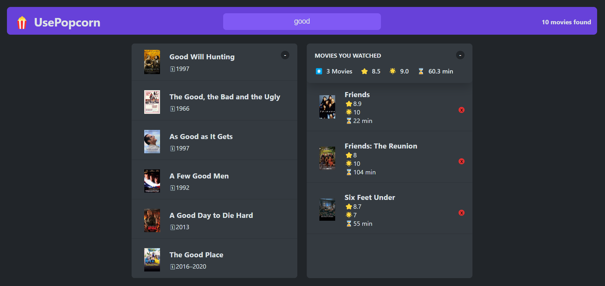

# UsePopcorn App For Online Movie Review

App for rotten tomatoes(For movie reviews) made by React.

# Built with

- JavaScript, React(v18.2)

# Reach the App

You need to follow these steps to reach the project
1-Clone the repo
2-In the project directory, you can run `npm install`
3-Run `npm start`

You can reach the project here, [app](https://berenvrl.github.io/usePopcorn-react/)

# Visual of the project

